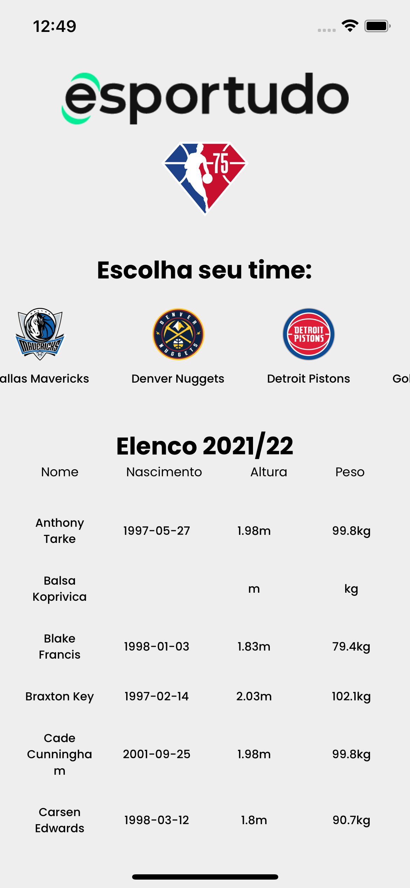

<p align="center">
  
</p>

<p align="center">
  
  


</p>

<h1 align="center">
    
</h1>

<br>

## 🧪 Technologies

This project was developed using the following technologies:
 
- [React Native](https://reactnative.dev/)
- [Typescript](https://www.typescriptlang.org/)
- [Expo](https://expo.io/)
- [Styled Components](https://styled-components.com/docs/basics)
- [Axios](https://axios-http.com/docs/intro)
- [API: API SPORTS NBA](https://api-sports.io/documentation/nba/v2#section/Introduction)

## 🚀 Getting started

Clone the project and access the folder.

```bash
$ git clone https://github.com/GersonRocha9/nba-rosters.git
$ cd nba-rosters
```

Follow the steps below:
```bash
# Install the dependencies
$ yarn

# Start the project
$ expo start
```

## 📝 License

This project is licensed under the MIT License. See the [LICENSE](LICENSE.md) file for details.

---

Made with 💚 by [Gerson Rocha](https://www.linkedin.com/in/gersonrocha/)